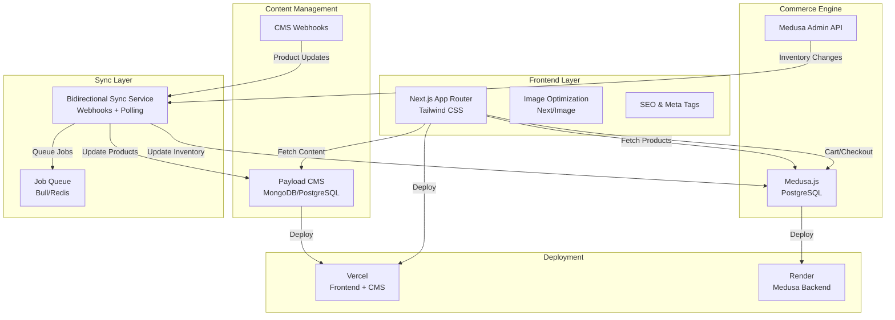
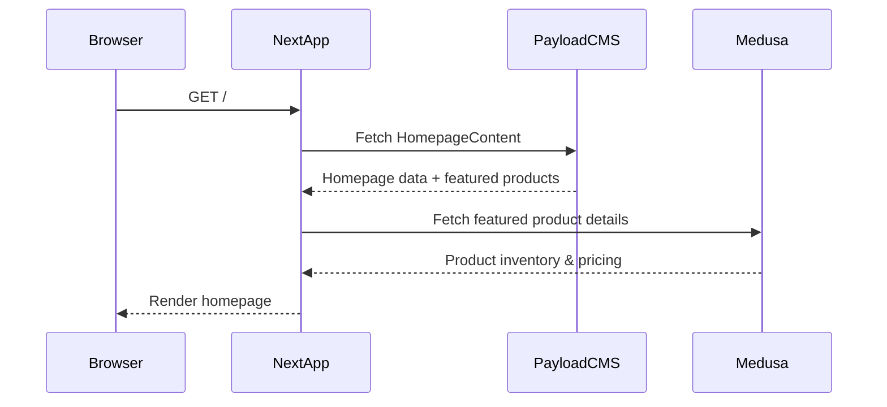
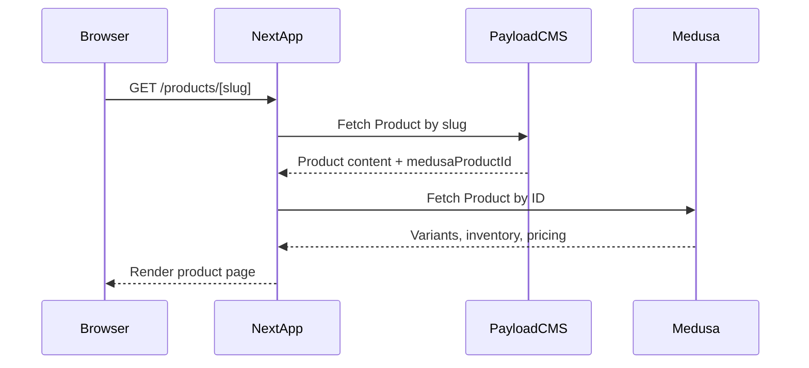
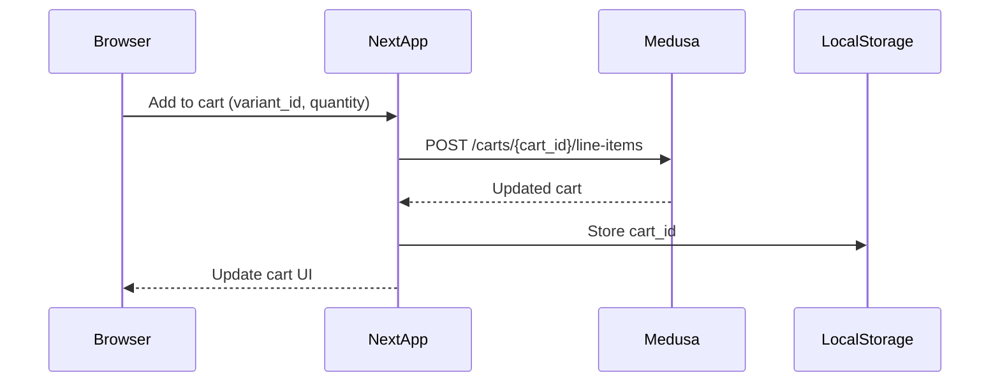
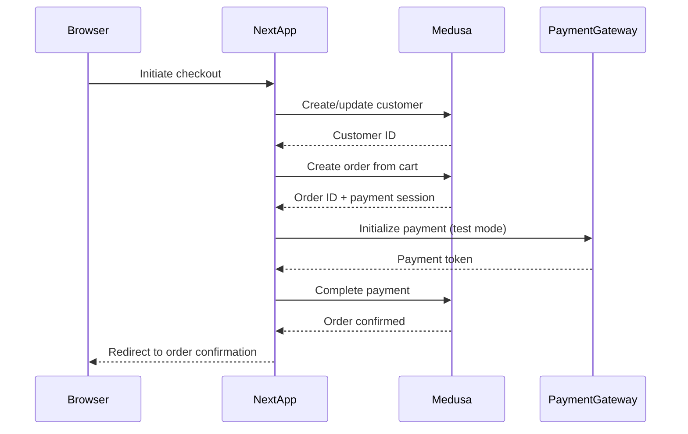
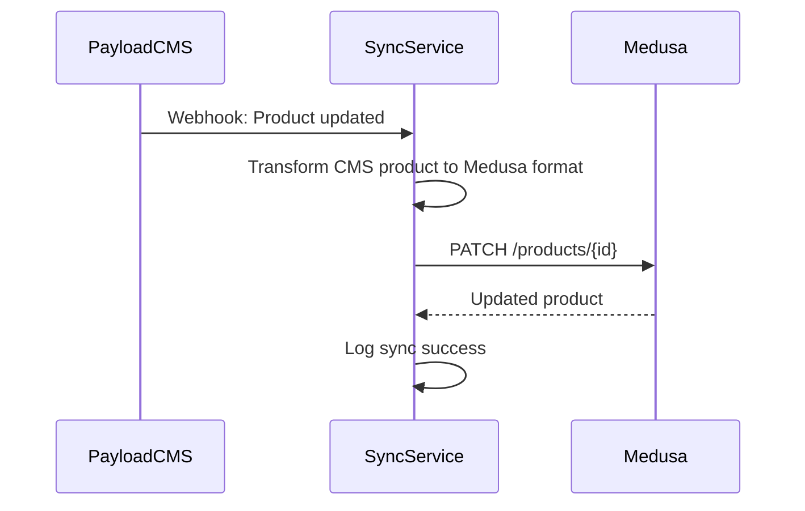
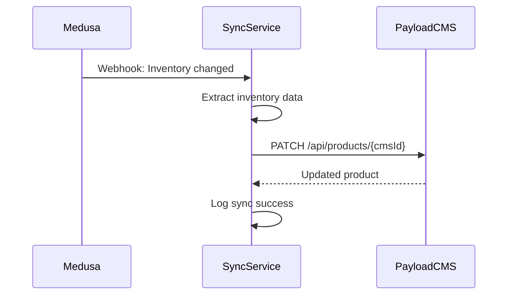

# Design Document: Cards Against Humanity Website Clone

## Overview

This document outlines the technical architecture for a pixel-perfect recreation of the Cards Against Humanity website with full e-commerce and CMS integration. The system combines a Next.js frontend with Payload CMS for content management and Medusa.js for commerce operations, synchronized bidirectionally to maintain consistency across platforms. The design prioritizes performance (90+ Lighthouse score), pixel-perfect UI matching, and a tight deployment timeline (March 12, 10:00 AM IST).

## Architecture



## System Components

### 1. Frontend (Next.js + Tailwind CSS)

**Purpose**: Render pixel-perfect UI, handle client-side interactions, manage cart state

**Key Responsibilities**:
- Render homepage and product pages matching CAH design
- Fetch dynamic content from Payload CMS
- Display products from Medusa commerce engine
- Manage shopping cart and checkout flow
- Implement responsive design for mobile
- Optimize images and performance
- Handle SEO and meta tags

**Technology Stack**:
- Next.js 14+ (App Router)
- Tailwind CSS for styling
- React Query or SWR for data fetching
- Zustand or Context API for cart state
- next/image for image optimization
- next-seo or similar for SEO

### 2. Payload CMS

**Purpose**: Centralized content management for all static and dynamic content

**Key Responsibilities**:
- Store and manage homepage content (hero, sections, text, images)
- Store and manage product page content (descriptions, images, CTAs)
- Store footer content, navigation, metadata
- Manage media library with optimized images
- Provide webhooks for content changes
- Expose REST/GraphQL API for frontend

**Deployment**: Vercel (same as frontend for reduced latency)

### 3. Medusa.js Commerce Engine

**Purpose**: Handle all e-commerce operations

**Key Responsibilities**:
- Product catalog management (SKUs, variants, pricing)
- Inventory tracking
- Shopping cart operations
- Order creation and management
- Payment processing (test mode)
- User authentication and profiles
- Provide REST API for frontend

**Deployment**: Render (free tier with PostgreSQL)

### 4. Bidirectional Sync Service

**Purpose**: Keep CMS and Medusa in sync

**Key Responsibilities**:
- Listen to CMS webhooks for product/content changes
- Listen to Medusa webhooks for inventory/pricing changes
- Transform and sync data between systems
- Handle conflict resolution
- Retry failed syncs with exponential backoff
- Log all sync operations for debugging

**Implementation Options**:
- Dedicated Node.js service on Render
- Serverless functions (Vercel Edge Functions or AWS Lambda)
- Scheduled polling as fallback

## Data Models

### CMS Data Models (Payload)

#### Product Collection
```
Product {
  id: UUID
  title: String (required)
  slug: String (required, unique)
  description: String (rich text)
  shortDescription: String
  heroImage: Media (required)
  galleryImages: Media[] (array)
  price: Number (synced from Medusa)
  medusaProductId: String (reference to Medusa)
  medusaVariantIds: String[] (array of variant IDs)
  category: String
  tags: String[]
  seo: {
    title: String
    description: String
    keywords: String[]
  }
  isActive: Boolean
  createdAt: DateTime
  updatedAt: DateTime
}
```

#### Homepage Content Collection
```
HomepageContent {
  id: UUID
  hero: {
    title: String
    subtitle: String
    backgroundImage: Media
    ctaText: String
    ctaLink: String
  }
  sections: Section[] (array of content sections)
  featuredProducts: Product[] (references)
  footer: {
    links: Link[]
    socialLinks: Link[]
    copyright: String
  }
  seo: SEO
  publishedAt: DateTime
  updatedAt: DateTime
}

Section {
  id: UUID
  type: Enum (hero, text, gallery, cta, products)
  title: String
  content: String (rich text)
  images: Media[]
  cta: {
    text: String
    link: String
  }
  order: Number
}
```

#### Navigation Collection
```
Navigation {
  id: UUID
  items: NavItem[] (array)
  updatedAt: DateTime
}

NavItem {
  id: UUID
  label: String
  href: String
  children: NavItem[] (nested)
  order: Number
}
```

### Commerce Data Models (Medusa)

#### Product
```
Product {
  id: UUID
  title: String
  description: String
  handle: String (slug)
  variants: ProductVariant[]
  images: ProductImage[]
  metadata: {
    cmsProductId: String (reference to Payload)
    pixelPerfectNotes: String
  }
  created_at: DateTime
  updated_at: DateTime
}

ProductVariant {
  id: UUID
  product_id: UUID
  title: String
  sku: String
  barcode: String
  price: Number (in cents)
  compare_at_price: Number
  inventory_quantity: Number
  manage_inventory: Boolean
  created_at: DateTime
  updated_at: DateTime
}

ProductImage {
  id: UUID
  product_id: UUID
  url: String
  alt_text: String
  order: Number
}
```

#### Cart & Order
```
Cart {
  id: UUID
  customer_id: UUID (nullable)
  items: LineItem[]
  subtotal: Number
  tax_total: Number
  shipping_total: Number
  total: Number
  created_at: DateTime
  updated_at: DateTime
}

LineItem {
  id: UUID
  cart_id: UUID
  product_id: UUID
  variant_id: UUID
  quantity: Number
  unit_price: Number
  total: Number
}

Order {
  id: UUID
  customer_id: UUID
  items: LineItem[]
  status: Enum (pending, confirmed, shipped, delivered, cancelled)
  payment_status: Enum (awaiting, captured, refunded)
  fulfillment_status: Enum (not_fulfilled, partially_fulfilled, fulfilled)
  subtotal: Number
  tax_total: Number
  shipping_total: Number
  total: Number
  created_at: DateTime
  updated_at: DateTime
}
```

#### Customer
```
Customer {
  id: UUID
  email: String (unique)
  first_name: String
  last_name: String
  phone: String
  password_hash: String
  addresses: Address[]
  created_at: DateTime
  updated_at: DateTime
}

Address {
  id: UUID
  customer_id: UUID
  first_name: String
  last_name: String
  street_1: String
  street_2: String
  city: String
  province: String
  postal_code: String
  country_code: String
  is_default_billing: Boolean
  is_default_shipping: Boolean
}
```

## API Integration Flows

### 1. Homepage Load Flow



**Optimization**:
- Cache homepage content for 5 minutes (ISR)
- Preload critical images
- Lazy load below-fold sections
- Use next/image for automatic optimization

### 2. Product Page Load Flow



**Optimization**:
- Generate static pages for known products
- Revalidate on-demand when CMS updates
- Cache product data for 10 minutes
- Preload variant images

### 3. Add to Cart Flow



**State Management**:
- Store cart_id in localStorage
- Sync cart state with Zustand/Context
- Persist cart across sessions
- Show real-time inventory availability

### 4. Checkout Flow



### 5. Bidirectional Sync Flow

#### CMS → Medusa (Product Update)



#### Medusa → CMS (Inventory Update)



**Sync Strategy**:
- Use webhooks for real-time sync
- Implement exponential backoff for retries (1s, 2s, 4s, 8s, max 60s)
- Store sync logs for debugging
- Handle conflicts: CMS is source of truth for content, Medusa for inventory
- Implement idempotency keys to prevent duplicate operations

## Frontend Architecture

### Page Structure

```
app/
├── layout.tsx                 # Root layout with providers
├── page.tsx                   # Homepage
├── products/
│   ├── page.tsx              # Products listing (if needed)
│   └── [slug]/
│       └── page.tsx          # Product detail page
├── cart/
│   └── page.tsx              # Cart page
├── checkout/
│   └── page.tsx              # Checkout page
├── account/
│   ├── login/page.tsx        # Login page
│   ├── register/page.tsx     # Register page
│   └── orders/page.tsx       # Order history
└── api/
    ├── cart/route.ts         # Cart API endpoints
    ├── checkout/route.ts     # Checkout API endpoints
    └── sync/route.ts         # Webhook receiver for sync
```

### Component Structure

```
components/
├── layout/
│   ├── Header.tsx            # Navigation + logo
│   ├── Footer.tsx            # Footer with links
│   └── Navigation.tsx        # Nav menu
├── homepage/
│   ├── Hero.tsx              # Hero section
│   ├── FeaturedProducts.tsx  # Featured products grid
│   └── ContentSection.tsx    # Dynamic content sections
├── product/
│   ├── ProductGallery.tsx    # Image gallery
│   ├── ProductInfo.tsx       # Title, description, price
│   ├── VariantSelector.tsx   # Size/variant picker
│   ├── AddToCart.tsx         # Add to cart button
│   └── RelatedProducts.tsx   # Related items
├── cart/
│   ├── CartDrawer.tsx        # Slide-out cart
│   ├── CartItem.tsx          # Individual cart item
│   └── CartSummary.tsx       # Subtotal, tax, total
├── checkout/
│   ├── ShippingForm.tsx      # Address entry
│   ├── PaymentForm.tsx       # Payment details
│   └── OrderReview.tsx       # Order summary
└── common/
    ├── Image.tsx             # Optimized image wrapper
    ├── Button.tsx            # Reusable button
    ├── Input.tsx             # Form input
    └── Loading.tsx           # Loading states
```

### State Management

**Cart State (Zustand)**:
```
CartStore {
  cartId: string | null
  items: LineItem[]
  total: number
  isLoading: boolean
  
  actions: {
    initCart(): Promise<void>
    addItem(variantId, quantity): Promise<void>
    removeItem(lineItemId): Promise<void>
    updateQuantity(lineItemId, quantity): Promise<void>
    clearCart(): Promise<void>
    fetchCart(): Promise<void>
  }
}
```

**User State (Context + localStorage)**:
```
UserContext {
  user: Customer | null
  isAuthenticated: boolean
  isLoading: boolean
  
  actions: {
    login(email, password): Promise<void>
    register(email, password, name): Promise<void>
    logout(): void
    fetchUser(): Promise<void>
  }
}
```

## Performance Optimization Strategy

### Image Optimization

**Implementation**:
- Use next/image for all images
- Generate multiple sizes: 320w, 640w, 1024w, 1920w
- Use WebP format with fallback
- Lazy load below-fold images
- Implement blur placeholder for hero images

**Configuration**:
```
Image {
  src: string
  alt: string
  width: number
  height: number
  priority?: boolean (for above-fold)
  placeholder?: 'blur' | 'empty'
  quality?: 75-85 (default 75)
}
```

### Code Splitting & Lazy Loading

- Dynamic imports for heavy components (checkout form, payment)
- Route-based code splitting (automatic with App Router)
- Lazy load cart drawer on first interaction
- Preload critical routes (product pages)

### Caching Strategy

**Frontend Caching**:
- ISR (Incremental Static Regeneration) for homepage: 5 minutes
- ISR for product pages: 10 minutes
- On-demand revalidation via CMS webhooks
- Browser cache: 1 hour for static assets

**API Caching**:
- React Query with 5-minute stale time for products
- 1-minute stale time for cart/inventory
- Revalidate on focus/visibility change

### Database Query Optimization

**Payload CMS**:
- Index on slug, medusaProductId
- Populate only required fields
- Use pagination for collections

**Medusa**:
- Index on handle, sku
- Eager load variants and images
- Use select to limit fields

### Metrics & Monitoring

**Lighthouse Targets**:
- Performance: 90+
- Accessibility: 90+
- Best Practices: 90+
- SEO: 90+

**Key Metrics**:
- LCP (Largest Contentful Paint): < 2.5s
- FID (First Input Delay): < 100ms
- CLS (Cumulative Layout Shift): < 0.1
- FCP (First Contentful Paint): < 1.8s

## SEO & Meta Tags

### Dynamic Meta Tags

**Homepage**:
```
title: "Cards Against Humanity - Official Store"
description: "Buy Cards Against Humanity and expansions. The party game for horrible people."
og:image: Hero image URL
og:type: website
```

**Product Pages**:
```
title: "{Product Name} - Cards Against Humanity"
description: "{Product short description}"
og:image: Product hero image
og:type: product
og:price:amount: {price}
og:price:currency: USD
```

**Implementation**:
- Use next-seo or next/head
- Fetch meta from Payload CMS
- Generate dynamic sitemap
- Add structured data (JSON-LD) for products

## Error Handling & Resilience

### API Error Handling

**Retry Strategy**:
- Exponential backoff: 1s, 2s, 4s, 8s, max 60s
- Max 3 retries for transient errors (5xx, timeout)
- No retry for client errors (4xx)
- Circuit breaker pattern for failing services

**User-Facing Errors**:
- Show friendly error messages
- Provide fallback UI
- Log errors to monitoring service
- Retry button for failed operations

### Sync Error Handling

**Conflict Resolution**:
- CMS is source of truth for content (title, description, images)
- Medusa is source of truth for inventory and pricing
- Timestamp-based conflict resolution
- Manual review queue for unresolved conflicts

**Monitoring**:
- Log all sync operations
- Alert on sync failures
- Dashboard for sync status
- Retry failed syncs hourly

## Security Considerations

### Authentication & Authorization

- Medusa handles customer authentication
- JWT tokens stored in httpOnly cookies
- CSRF protection on forms
- Rate limiting on auth endpoints

### Data Protection

- HTTPS only (enforced by Vercel/Render)
- Sensitive data encrypted at rest (passwords, payment info)
- PCI compliance for payment processing (use Medusa's payment plugins)
- No hardcoded secrets (use environment variables)

### Input Validation

- Validate all user inputs on frontend and backend
- Sanitize rich text content from CMS
- Prevent XSS attacks
- SQL injection prevention (use ORMs)

## Deployment Strategy

### Frontend (Vercel)

**Environment Setup**:
```
NEXT_PUBLIC_MEDUSA_URL=https://medusa-backend.render.com
NEXT_PUBLIC_PAYLOAD_URL=https://cms.vercel.app
NEXT_PUBLIC_STRIPE_KEY=pk_test_...
```

**Deployment**:
- Connect GitHub repo to Vercel
- Auto-deploy on push to main
- Preview deployments for PRs
- Environment-specific configs

### CMS (Vercel)

**Environment Setup**:
```
DATABASE_URI=mongodb+srv://...
PAYLOAD_SECRET=...
MEDUSA_WEBHOOK_SECRET=...
```

**Deployment**:
- Deploy alongside frontend or separate
- Webhook endpoint: /api/webhooks/medusa

### Commerce Backend (Render)

**Environment Setup**:
```
DATABASE_URL=postgresql://...
JWT_SECRET=...
STRIPE_API_KEY=sk_test_...
PAYLOAD_WEBHOOK_SECRET=...
```

**Deployment**:
- Deploy Medusa to Render free tier
- PostgreSQL database on Render
- Webhook endpoint: /webhooks/payload

## Testing Strategy

### Unit Testing

**Framework**: Jest + React Testing Library

**Coverage**:
- Components: 80%+
- Utilities: 90%+
- Hooks: 85%+

**Key Tests**:
- Component rendering with different props
- User interactions (click, input)
- State updates
- Error states

### Integration Testing

**Framework**: Playwright or Cypress

**Scenarios**:
- Homepage load and rendering
- Product page load with variants
- Add to cart flow
- Checkout flow (test payment)
- User registration and login
- Cart persistence across sessions

### Performance Testing

**Tools**: Lighthouse CI, WebPageTest

**Targets**:
- Lighthouse score 90+ on all metrics
- LCP < 2.5s
- FID < 100ms
- CLS < 0.1

### Sync Testing

**Scenarios**:
- CMS product update syncs to Medusa
- Medusa inventory update syncs to CMS
- Conflict resolution works correctly
- Retry logic handles failures
- Idempotency prevents duplicates

## Development Timeline

**Phase 1 (Days 1-2)**: Setup & Infrastructure
- Initialize Next.js, Payload CMS, Medusa projects
- Configure databases and deployments
- Set up GitHub repos and CI/CD

**Phase 2 (Days 3-4)**: Frontend Foundation
- Create layout components (header, footer, nav)
- Implement homepage structure
- Set up Tailwind CSS and responsive design
- Implement image optimization

**Phase 3 (Days 5-6)**: CMS Integration
- Create Payload CMS collections
- Implement content fetching
- Set up webhooks
- Test content updates

**Phase 4 (Days 7-8)**: Commerce Integration
- Integrate Medusa API
- Implement product display
- Build cart functionality
- Implement checkout flow

**Phase 5 (Days 9-10)**: Sync & Polish
- Implement bidirectional sync
- Performance optimization
- Mobile responsive design
- Bug fixes and testing

**Phase 6 (Days 11-12)**: Final Testing & Deployment
- Lighthouse optimization
- Integration testing
- Deployment to production
- Final QA

## Correctness Properties

### Product Sync Correctness

**Property 1**: Every product created in CMS must exist in Medusa within 30 seconds
```
∀ product ∈ CMS.products:
  ∃ medusaProduct ∈ Medusa.products:
    medusaProduct.title = product.title ∧
    medusaProduct.metadata.cmsProductId = product.id ∧
    timestamp(medusaProduct.created_at) - timestamp(product.createdAt) ≤ 30s
```

**Property 2**: Inventory changes in Medusa must reflect in CMS within 1 minute
```
∀ variant ∈ Medusa.variants:
  ∃ cmsProduct ∈ CMS.products:
    cmsProduct.medusaVariantIds contains variant.id ∧
    cmsProduct.inventory = variant.inventory_quantity ∧
    timestamp(cmsProduct.updatedAt) - timestamp(variant.updated_at) ≤ 60s
```

### Cart Consistency

**Property 3**: Cart total must equal sum of line items
```
∀ cart ∈ Medusa.carts:
  cart.total = sum(lineItem.total for lineItem in cart.items) +
               cart.tax_total + cart.shipping_total
```

**Property 4**: Cart items must reference valid products and variants
```
∀ lineItem ∈ cart.items:
  ∃ product ∈ Medusa.products:
    product.id = lineItem.product_id ∧
    ∃ variant ∈ product.variants:
      variant.id = lineItem.variant_id
```

### Order Integrity

**Property 5**: Order cannot be modified after payment is captured
```
∀ order ∈ Medusa.orders:
  order.payment_status = 'captured' ⟹
    order.items is immutable ∧
    order.total is immutable
```

**Property 6**: Order total must match cart total at time of creation
```
∀ order ∈ Medusa.orders:
  ∃ cart ∈ Medusa.carts:
    order.created_from_cart_id = cart.id ⟹
      order.total = cart.total (at time of order creation)
```

### Performance Properties

**Property 7**: Homepage must load within 2.5 seconds (LCP)
```
∀ request to GET /:
  LCP(response) ≤ 2.5s
```

**Property 8**: Product pages must be cached and served from CDN
```
∀ request to GET /products/[slug]:
  response.headers['cache-control'] contains 'public' ∧
  response.headers['x-vercel-cache'] ∈ {'HIT', 'STALE'}
```

## Dependencies & External Services

### Frontend Dependencies
- next: ^14.0.0
- react: ^18.0.0
- tailwindcss: ^3.0.0
- zustand: ^4.0.0
- react-query: ^3.0.0 or swr: ^2.0.0
- next-seo: ^6.0.0
- axios or fetch API

### CMS Dependencies
- payload: ^2.0.0
- mongodb or postgresql driver
- express: ^4.0.0
- dotenv: ^16.0.0

### Commerce Dependencies
- @medusajs/medusa: ^1.0.0
- @medusajs/admin: ^7.0.0
- typeorm: ^0.3.0
- express: ^4.0.0
- stripe: ^12.0.0 (for payments)

### Sync Service Dependencies
- node: ^18.0.0
- axios: ^1.0.0
- bull: ^4.0.0 (job queue)
- redis: ^4.0.0 (for Bull)
- dotenv: ^16.0.0

### Deployment Services
- Vercel (frontend + CMS)
- Render (Medusa backend)
- MongoDB Atlas or PostgreSQL (databases)
- Redis (for job queue)

## Risk Mitigation

### Timeline Risk
- **Risk**: 12-day deadline is extremely tight
- **Mitigation**: 
  - Use template/starter projects where possible
  - Prioritize MVP features first
  - Parallel development of frontend and backend
  - Automated testing to catch issues early

### Sync Complexity Risk
- **Risk**: Bidirectional sync is complex and error-prone
- **Mitigation**:
  - Implement comprehensive logging
  - Use idempotency keys
  - Start with one-way sync (CMS → Medusa), add reverse later if time permits
  - Manual sync endpoint for emergency fixes

### Performance Risk
- **Risk**: Achieving 90+ Lighthouse score is challenging
- **Mitigation**:
  - Implement image optimization early
  - Use ISR for static content
  - Monitor metrics continuously
  - Optimize database queries
  - Use CDN for static assets

### Pixel-Perfect Risk
- **Risk**: Matching CAH design exactly is time-consuming
- **Mitigation**:
  - Use browser DevTools to measure spacing/colors
  - Create reusable component library
  - Use Tailwind CSS for consistency
  - Implement responsive design systematically

## Conclusion

This design provides a comprehensive, scalable architecture for the Cards Against Humanity website clone. The separation of concerns (frontend, CMS, commerce) allows for parallel development and independent scaling. The bidirectional sync ensures data consistency across systems while maintaining flexibility for future enhancements. Performance optimization is built in from the start, and the modular design supports rapid iteration within the tight timeline.
